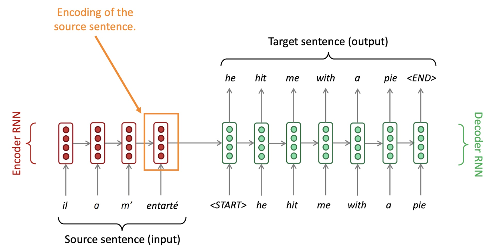
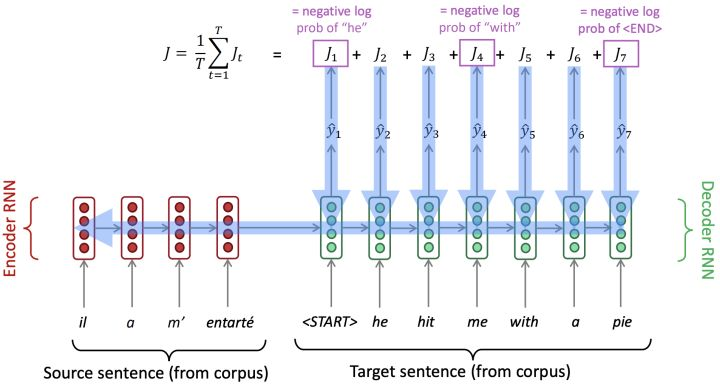
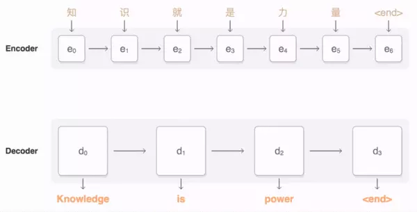
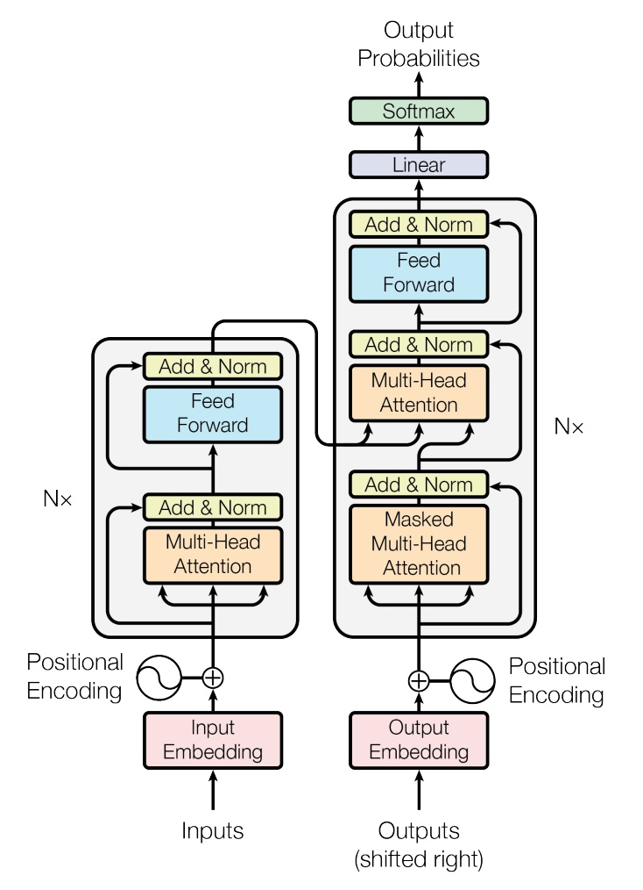
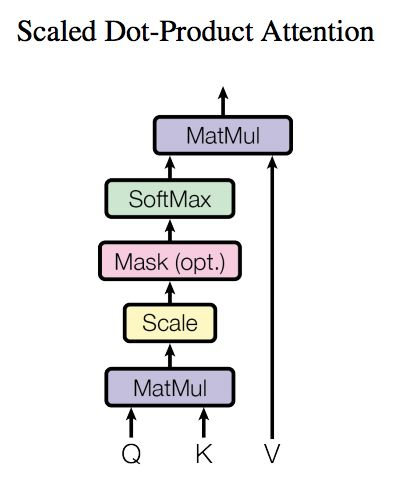

# Language Model （语言模型）

参考来源：
- [(2019)斯坦福CS224n深度学习自然语言处理课程 by Chris Manning
](https://www.bilibili.com/video/BV1Eb411H7Pq)
- [斯坦福CS224N深度学习自然语言处理2019冬学习笔记目录](https://zhuanlan.zhihu.com/p/59011576)
- [Attention机制详解（一）——Seq2Seq中的Attention](https://zhuanlan.zhihu.com/p/47063917)
- [Attention机制详解（二）——Self-Attention与Transformer](https://zhuanlan.zhihu.com/p/47282410)

## Language Modeling （语言建模）
语言建模（Language Modeling）就是下一个出现的词汇会是什么的任务。

给一个单词序列 $\boldsymbol{x}^{(1)}, \boldsymbol{x}^{(2)}, \ldots, \boldsymbol{x}^{(t)}$，计算下一个词 $\boldsymbol{x}^{(t+1)}$ 的概率分布: 
$$
P\left(\boldsymbol{x}^{(t+1)} | \boldsymbol{x}^{(t)}, \ldots, \boldsymbol{x}^{(1)}\right)
$$
其中，$\boldsymbol{x}^{(t+1)}$ 可以是 $V=\left\{\boldsymbol{w}_{1}, \ldots, \boldsymbol{w}_{|V|}\right\}$ 中的任何单词。

完成这样的任务的系统，就叫**语言模型（Language Model）**。

## Language Model （语言模型）

### N-gram 模型
n-gram 的定义就是连续的n个单词。

例如: 
"the students opened their" 这句话
- unigram: "the", "students", "opened", "their"
- bigram: "the students", "students opened", "opened their"
- 3-gram: " the students opened ", " students opened their"
- ...

$$\begin{array}{c}
P\left(x^{(t+1)} | x^{(t)}, \ldots, x^{(1)}\right)=P\left(x^{(t+1)} | x^{(t)}, \ldots, x^{(t-n+2)}\right)= \\
\frac{P\left(x^{(t+1)}, x^{(t)}, \ldots, x^{(t-n+2)}\right)}{P\left(x^{(t)}, \ldots, x^{(t-n+2)}\right)} \approx \frac{\operatorname{count}\left(x^{(t+1)}, x^{(t)}, \ldots, x^{(t-n+2)}\right)}{\operatorname{count}\left(x^{(t)}, \ldots, x^{(t-n+2)}\right)}
\end{array}$$

n-gram 模型的问题：
- 稀疏问题 Sparsity Problem。
- 必须存储所有的 n-gram 对应的计数，随着n的增大，模型存储量也会增大。

所以 n 的大小不能设置得太大，但是设置小了，当上下文相对较长时限制了推测单词的能力。所以用 n-gram 生成文本时，很大概率是乱七八糟的废话。
。

### RNN 模型
RNN 模型的优势： 
- 可以处理任意长度的输入。
- **理论上** t 时刻可以利用之前很早的历史信息。
- 对于长的输入序列，模型大小并不增加。
- 每一时刻都采用相同的权重矩阵，有效的进行了参数共享。

RNN 模型的劣势： 
- 由于需要顺序计算而不是并行计算，RNN 计算较慢。
- 由于**梯度消失**等问题，距离较远的早期历史信息难以捕捉。

### LSTM/GRU 模型

Transformers 没出来前，LSTM 是表现最好的。

LSTM 和 GRU 解决了梯度消失问题。

#### LSTM
LSTM 引入 cell state 来存储长程信息，LSTM 可以通过控制 gate 来擦除，存储或写入 cell state。

LSTM 公式：
$$\begin{aligned}
&i_{t}=\sigma\left(W^{(i)} x_{t}+U^{(i)} h_{t-1}\right) \quad \text { (Input gate) }\\
&f_{t}=\sigma\left(W^{(f)} x_{t}+U^{(f)} h_{t-1}\right) \quad \text { (Forget gate) }\\
&o_{t}=\sigma\left(W^{(o)} x_{t}+U^{(o)} h_{t-1}\right) \quad \text { (Output/Exposure gate) }\\
&\tilde{c}_{t}=\tanh \left(W^{(c)} x_{t}+U^{(c)} h_{t-1}\right) \quad \text { (New memory cell) }\\
&c_{t}=f_{t} \circ c_{t-1}+i_{t} \circ \tilde{c}_{t} \quad \text { (Final memory cell) } \\
&h_{t}=o_{t} \circ \tanh \left(c_{t}\right)
\end{aligned}
$$

#### GRU
GRU (gated recurrent unit) 可以看做是将LSTM中的forget gate和input gate合并成了一个update gate。

GRU 公式：
$$\begin{aligned}
&z_{t}=\sigma\left(W^{(z)} x_{t}+U^{(z)} h_{t-1}\right) \quad \text { (Update gate) }\\
&r_{t}=\sigma\left(W^{(r)} x_{t}+U^{(r)} h_{t-1}\right) \quad \text { (Reset gate) }\\
&\tilde{h}_{t}=\tanh \left(r_{t} \circ U h_{t-1}+W x_{t}\right) \quad \text { (New memory) }\\
&h_{t}=\left(1-z_{t}\right) \circ \tilde{h}_{t}+z_{t} \circ h_{t-1} \quad \text { (Hidden state) }
\end{aligned}$$

和 LSTM 的最大的区别就是 GRU 有更少的参数，更便于计算，对于模型效果方面，两者类似。通常我们可以从LSTM开始，如果需要提升效率的话再换成 GRU。

### Seq2Seq：Encode-decode
在机器翻译（Machine Translation）领域，早期的机器翻译很多是人为 rule-based 的，随后逐渐发展出依赖于统计信息的 Statistical Machine Translation（SMT），之后又发展出利用神经网络使得准确度大幅改善的Neural Machine Translation（NMT）。

NMT 依赖于 Sequence-to-Sequence 的模型架构，以及后来有了进一步将其改善的 Attention 机制。

Seq2seq 模型由 Encoder RNN 和 Decoder RNN 构成：

Seq2Seq 是一个端到端（end2end）模型，失函数的梯度可以一直反向传播到encoder，模型可以整体优化：

$$J(\theta)=\frac{1}{T} \sum_{t=1}^{T} J^{(t)}(\theta)=\frac{1}{T} \sum_{t=1}^{T}-\log \hat{\boldsymbol{y}}_{\boldsymbol{x}_{t+1}}^{(t)}$$

#### Beam search decoding
我们可以选择贪婪解码（greedy decoding）即每一步均选取概率最大的单词并将其作为下一步的 decoder input，但是当前的最大概率的单词对于翻译整个句子来讲不一定是最优的选择。

这时候我们就有了 **beam search decoding**。就是在decoder的每一步，我们不仅仅是取概率最大的单词，而是**保存 k 个当前最有可能**的翻译假设，其中 k 称作 beam size，通常在 5 到 10 之间。

#### SMT vs. NMT
与 SMT 相较，NMT 的优点：
- 可以整体的优化模型，而不是需要分开若干个模型各自优化
- 需要的特征工程较少
- 模型更灵活
- 准确度也更高

NMT 的缺点：
- 更难理解也更难纠错
- 难以设定一些人为的规则来进行控制

#### Attention 机制
Seq2Seq 模型有个问题，就是我们需要将输入的所有信息都 encode 到 encoder 的最后一个 hidden state 上，这通常是不现实的。

所以引入注意力机制来消除这一瓶颈：在 decoder 的每一步，通过与 encoder 的直接关联来决定当前翻译应关注的源语句的重点部分。

### Transformers
Attention 模型本身可以看到全局的信息，那么去掉 RNN 而仅仅依赖于Attention 模型的就是 Transformers；这样的话，没有 RNN 我们就可以使训练并行化，同时又拥有全局信息。

Transformer 模型的整体结构：

这里面的 Multi-head Attention 其实就是多个 Self-Attention 结构的结合。

Self-Attention 基本结构：   

详细的可以看这个图解 Transformer：[The Illustrated Transformer](https://jalammar.github.io/illustrated-transformer/)

### BERT

## 评估语言模型

### Perplexity （困惑度）
标准的语言模型评估指标是用困惑度（Perplexity）：
$$\text { perplexity }=\prod_{t=1}^{T}\left(\frac{1}{P_{\mathrm{LM}}\left(\boldsymbol{x}^{(t+1)} | \boldsymbol{x}^{(t)}, \ldots, \boldsymbol{x}^{(1)}\right)}\right)^{1 / T}$$

实际上，困惑度是交叉熵的指数形式：
$$
\prod_{t=1}^{T}\left(\frac{1}{\hat{\boldsymbol{y}}_{x_{t+1}}^{(t)}}\right)^{1 / T}=\exp \left(\frac{1}{T} \sum_{t=1}^{T}-\log \hat{\boldsymbol{y}}_{x_{t+1}}^{(t)}\right)=\exp (J(\theta))
$$
Perplexity 越小越好。

### BLEU
对于机器翻译模型，一个常用的指标是 BLEU（Bilingual Evaluation Understudy)。

BLEU score 可以表示为：
$$\mathrm{BLEU}=\beta \prod_{i=1}^{k} p_{n}^{w_{n}}$$

其中：
- k通常选为4
- n-gram 的 precision score: $p_{n}=\#$ matched n-grams $/ \#$ n-grams in candidate translation 
- 权重：$w_{n}=1 / 2^{n}$
- 对过短的翻译的 penalty：$\beta=e^{\min \left(0,1-\frac{\operatorname{lcn}_{\mathrm{ref}}}{\operatorname{len}_{\mathrm{MT}}}\right)}$